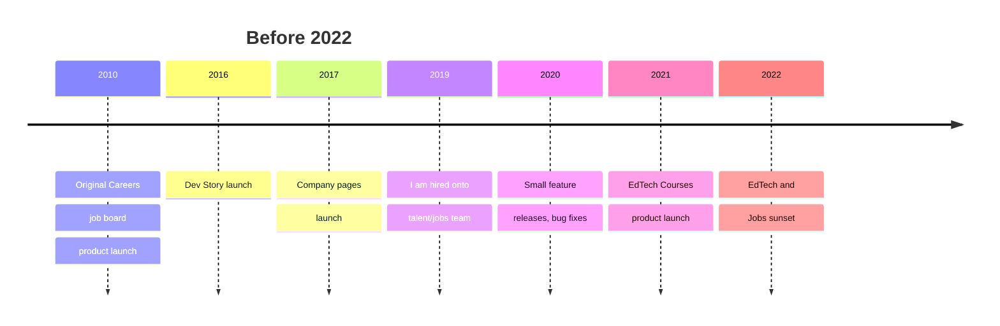
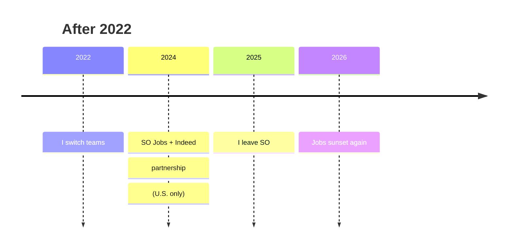
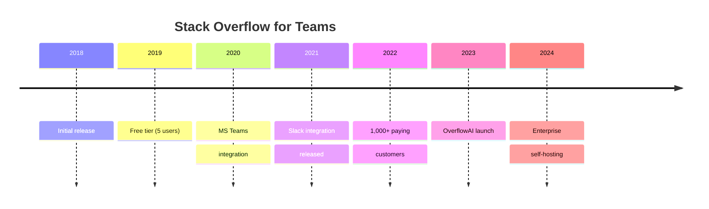
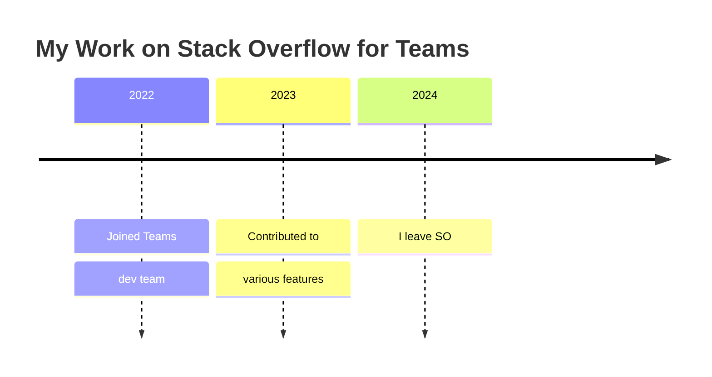

# Full-Stack Software Developer at Stack Exchange / Stack Overflow (July 2019 – Present)

## Talent, Ads, Jobs, and Hiring

The Internet Archive has a viewable version of what I worked on during this time:  
[https://web.archive.org/web/20210331003831if_/http://stackoverflow.com/jobs](https://web.archive.org/web/20210331003831if_/http://stackoverflow.com/jobs)

Feel free to see how it changes over time — some changes were implemented by me, and many others were reviewed or tested by me.

I also contributed to various repositories within the organization.

### What were Stack Overflow Jobs, Careers, and Developer Stories?

Stack Overflow Jobs and Developer Stories were two major career-focused features on Stack Overflow. Launched in 2016, Developer Story was Stack Overflow's attempt to replace the traditional resume. It offered a dynamic timeline where developers could showcase:

- **Projects and Contributions** – GitHub repos, open-source work, and blog posts
- **Technical Skills** – specific technologies and programming languages used
- **Achievements** – certifications and significant milestones

The goal was to focus on **what you built or worked on** rather than just where you worked or studied. However, the feature was discontinued in 2022 because Stack Overflow decided to move away from direct hiring products and focus on "employer branding" (advertising). Jobs later returned in a different partnership form before ultimately shutting down again in 2026.

### How Dev Stories, Jobs, and Company Pages Worked
- Regular Stack Overflow users have an account with their question browsing, asking, and answering history
- A regular user can go to their profile and add different Dev Story items (achievements, certifications, proficiencies)
- A company has a company team and company page on Stack Overflow
- The user can follow the company page for updates
- If the company page has jobs the user can browse the jobs
- If the company pays for advertisement slots then the jobs can be displayed across the site algorithmically
- Job ads are fetched via bidding and displayed in an iframe for security

### History of Stack Overflow Jobs and Company Pages

Stack Overflow Jobs went through five distinct phases:

- **Phase 1:** The Minimal Viable Product
    - A basic platform for job postings and developer resumes.
- **Phase 2:** First Relaunch, a More Complete Product
    - The job board was improved and features like an Application Tracking System and messaging were added. 
    - Smaller features were incrementally added, like favoring jobs, reacting to jobs, following company page blog posts.
- **Phase 3:** First Sunset
    - Alongside Developer Story, it was shut down on March 31, 2022, as part of a strategic shift away from recruitment.
- **Phase 4:** The Relaunch
    - In 2024, due to popular demand, Stack Overflow brought Jobs back in partnership with Indeed. 
    - This version redirected users to Indeed to apply.
- **Phase 5:** Final Sunset
    - In 2026, the partnership with Indeed ended. The final version of Stack Overflow Jobs ceased operations for good on April 1, 2026.

### Timeline: Jobs & Developer Story

After the Jobs sunset in 2022, I switched to the Teams team, and was no longer contributing to the Jobs portion of the site.

#### My Impact
- Implemented different job ad data ingestion methods for different companies
- Implemented favorite jobs and other small features for candidates on the job board side
- Helped implement company page features like infinitely scrolling blog posts
- Implemented a Elastic-Search backed search for candidate-employer messages with sentiment analysis to detect negative messages
- Investigated platform abuse and attempted breaches, user reports

### EdTech Learning Course aka Sponsored Content Ads
Around 2019–2020, Stack Overflow tested **native ad placements** for online learning platforms and coding boot-camps. These ads targeted users based on their **tag preferences** and **question activity** (e.g., a developer following the `python` tag or looking at a python question might see a Coursera Python course ad). Several leading EdTech companies were part of early tests and pilot program.

#### How It Worked
 - **Tag-based targeting** Ads shown to users actively asking/answering questions in relevant technology tags
 - **Native format** Ads appeared within the question feed or sidebar, mimicking organic Stack Overflow styling
 - **Click-to-enroll** Direct links to course pages; some included discount codes or Stack Overflow affiliate tracking
 - **Limited scope** Described internally as an "experiment" — never rolled out as a permanent, scaled product

#### Why It Ended
1. **Low conversion rates** – Developers actively solving a specific problem (e.g., "why is my loop breaking?") are not in a "learning mode" mindset for a full course.
2. **Ad blindness** – Stack Overflow users are notoriously ad-resistant; native formats saw modest click-through rates.
3. **Strategic refocus** – Stack Overflow prioritized high-margin B2B products (Teams, Talent) over lower-margin EdTech affiliate revenue.
4. **Brand fit concerns** – Some developers complained that learning ads felt "spammy" or irrelevant to their immediate debugging needs.

#### My Impact
- Implemented the **ad targeting engine** that powered these EdTech placements, integrated with the data team's AI models
- Helped analyze **A/B test results** comparing course ad performance vs. traditional job ads
- Contributed to the **ad rendering pipeline** (sidebar, feed injection and native placements)
- Worked on **tracking and analytics** for conversion events (clicks, enrollments, affiliate data passthrough)

---

## Stack Overflow Teams

Stack Overflow for Teams is a private, enterprise-focused knowledge management and collaboration platform. It applies the familiar Q&A format of Stack Overflow to an organization's internal knowledge, allowing teams to create a private, secure repository of information. It uses gamification (voting, reputation) and developer-centric workflows to solve enterprise knowledge silos. Third-party chat integrations result in increased user engagement and reduced context switching. During my time working on it, the platform was available in four plans: **Free**, **Basic**, **Business**, and **Enterprise**.

### My Impact

- Implement different business features for individual contributors, groups of coworkers, and managers of teams.

### How does Stack Overflow for Teams work?

#### 1. Private Q&A Engine
The product provides a private, searchable repository for organizational knowledge. It uses the same familiar Stack Overflow interface (asking, answering, commenting) but behind a company's firewall. Users can vote on answers to surface the best solutions, just like on the public site.

#### 2. Developer Workflow Integration
A key feature is deep integration with chat tools. The platform integrates with Slack and Microsoft Teams, allowing users to:
- Search the knowledge base using commands (e.g., `/stack search`)
- Ask new questions directly from chat
- Receive notifications when answers are posted

#### 3. Gamification & Reputation 
Unlike generic wikis, it uses reputation points and badges to reward subject matter experts (SMEs) for answering questions. Features like "bounties" allow users or admins to award points to encourage answers to tough questions.

### Timeline: Stack Overflow for Teams

### Timeline: My Impact on Stack Overflow for Teams

---

**Disclaimer:** This page was partially generated with the assistance of DeepSeek. All information has been checked for accuracy.